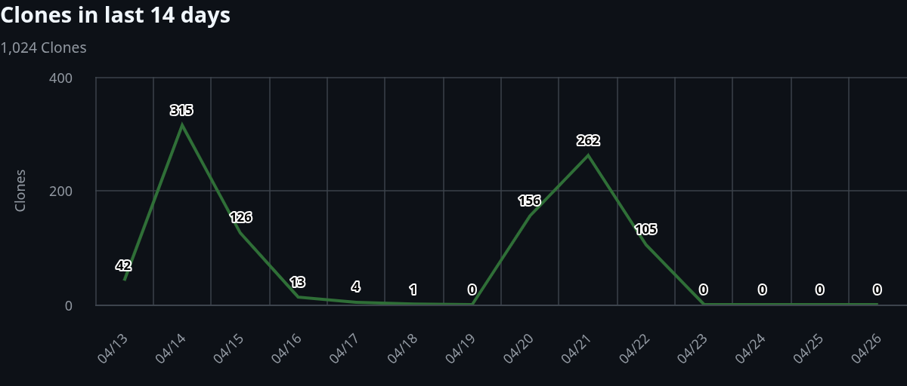
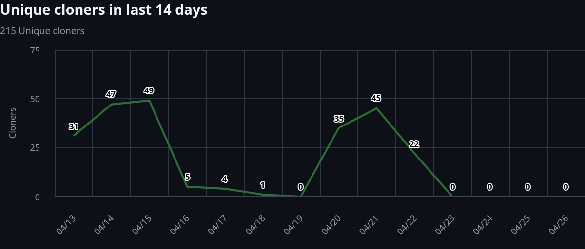

# Week 6: Autonomous Orchestration & Agentic Interactions

This week was centered on **Onhandl**, pushing the boundaries of autonomous orchestration on the CKB network. The focus shifted from wallet development to extending  a robust infrastructure for AI agents that can manage assets and execute financial policies independently.

---

## 🤖 Onhandl: Autonomous Orchestration

**Onhandl** is a platform designed for the autonomous orchestration of financial agents. It allows for the creation of agents that can:
- **Monitor addresses**: Track incoming transactions and assets on the CKB network in real-time.
- **Execute internal policies**: Process received assets according to predefined rules (e.g., splitting funds, forwarding to cold storage, or trigger-based payments).
- **Independent Operation**: Once deployed, these agents operate without manual intervention, providing a truly "set and forget" financial automation layer.

### 💎 Featured Agent: The Auto-Splitter
The primary agent developed this week focuses on **automated asset distribution**. When it receives CKB , it immediately executes a split-and-pay policy to multiple destination addresses.

**Use Cases:**
- **DAO Revenue Sharing**: Automatically distribute platform fees among contributors or treasury addresses.
- **Payroll Automation**: Split incoming budget into salary payments across multiple staff wallets.
- **Micro-Investment**: Automatically allocate a percentage of every incoming deposit into different secondary wallets for savings or specific goals.

---

## 📊 Week 6 Insights & Data

During this week, we successfully captured a variety of **agentic interactions**. I set up two primary agents, and several others were initialized by some friends, providing a rich dataset of autonomous transactions.

### 📈 Traffic & Clones
The Onhandl repository saw significant engagement this week. Below are the metrics showing the project's growth and developer interest:

*Traffic overview: Total Github clones in the last 14 days.*

*Developer Engagement: Unique Github cloners showing distinct interest in the orchestration layer.*

### 🛠️ Technical Milestone: The Indexing Layer
The most significant engineering effort this week was dedicated to the **Indexing Layer**. This component is critical for:
- Ensuring low-latency discovery of new transaction cells.
- Maintaining consistent state across asynchronous agent nodes.
- Handling the CKB cell model efficiently to support high-frequency agent interactions.

---

## 🔗 Resources

- **GitHub Repository**: [onhandl/Onhandl](https://github.com/onhandl/Onhandl)
- **Demo Video**: [Onhandl Week 6 Walkthrough](https://youtu.be/IpHDeLglz2E)
- **Sample Agent Interactions**: 
    - [Captured Data 1](https://docs.google.com/spreadsheets/d/1d6KEbWPY0UuD5NN0xWcA3A2yh4K0nLq-LmlWP1idW_0/edit?usp=sharing)
    - [Captured Data 2](https://docs.google.com/spreadsheets/d/13owesLd2SqOn-PyqsAsWxO1WKVfr4HQqjtu9oXFRH14/edit?usp=sharing)

---