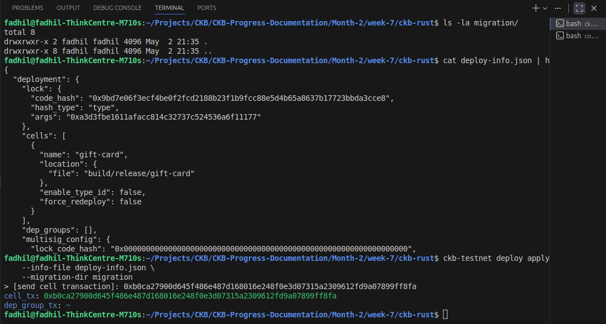
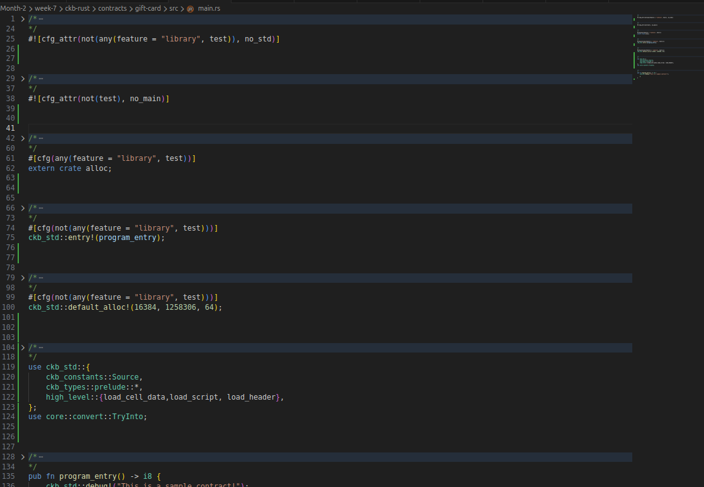

# Week 7: CKB Deep Dive & First On-Chain Contract

This week marked the transition from high-level TypeScript development to low-level CKB scripting in Rust. Previously, CKB interactions were handled through the CCC library in Node.js, a convenient abstraction layer that hides the underlying Cell model and transaction structure. This week, that abstraction was stripped away entirely.

---

## From CCC to Bare Metal

The shift from Node.js + CCC to Rust represents a fundamental change in development approach:

| Before (CCC/Node.js) | Now (Rust + ckb-std) |
|---------------------|----------------------|
| Abstracted Cell creation | Manual Cell structure construction |
| Library handles serialization | Direct molecule serialization with `.pack()` / `.unpack()` |
| Pre-built transaction helpers | Building transactions field by field |
| No visibility into VM execution | Writing code that runs inside CKB-VM |
| npm dependencies | RISC-V compilation target |

This transition laid the foundation for understanding CKB at the protocol level. Instead of calling a library function to "create a cell with a type script," every field was configured explicitly -- `code_hash`, `hash_type`, `args`, `capacity`, `lock`, and `data` -- building a mental model of exactly what goes on-chain.

---

## Understanding the CKB Cell Structure

Before writing any contract, time was spent dissecting the Cell, the atomic unit of state in CKB. Unlike account-based blockchains where state lives in smart contract storage, CKB uses a UTXO-inspired model where each Cell is an independent state container.

A Cell consists of four fields:

| Field | Purpose | Example |
|-------|---------|---------|
| `capacity` | Size limit in bytes AND the CKB token amount stored. Occupying state costs tokens. | `1000 CKB` |
| `data` | Arbitrary state stored on-chain. Can be empty, UTF-8 text, or serialized structs. | `"Happy birthday!"` |
| `lock` | A script that controls ownership. Must execute successfully when the Cell is consumed as an input. | `secp256k1_blake160_sighash_all` |
| `type` | A script that controls state transition rules. Executes on both inputs and outputs with the same type script. | Our gift card validation logic |

Scripts are not the code itself, they are pointers to code. Each script contains:
- `code_hash`: The Blake2b hash identifying the compiled binary
- `hash_type`: How to interpret the code_hash (`data` = hash of cell data, `type` = hash of type script)
- `args`: Custom bytes passed to the script for configuration

Cells are consumed and created in transactions. State transitions happen off-chain -- the client constructs the new state, and the CKB-VM only validates that the rules were followed. This "generate locally, verify globally" model is the core philosophy behind CKB development.

---

## First Rust Contract: On-Chain Gift Card

With the Cell model understood, development began on a time-locked gift card contract written in Rust.

Contract logic:
1. Anyone can create a gift card Cell with a message and a `claim_block` stored in the type script's `args`
2. The lock script is set to `anyone_can_pay` (no ownership restriction)
3. Before the `claim_block`, any transaction attempting to consume the Cell is rejected
4. After the `claim_block`, the first person to submit a valid transaction gets the funds
5. The message in the `data` field must remain unchanged

Contract structure:
```
contracts/gift-card/src/main.rs
  no_std / no_main configuration
  default_alloc setup for CKB-VM memory
  load_script() reads claim block from args
  load_header() reads current block number
  Block comparison: reject if current < claim
  load_cell_data() reads input and output messages
  Data integrity check: input must match output
```

Local testing was performed using `ckb-testtool`, simulating three scenarios:
- Claim after the block (should succeed)
- Claim before the block (correctly rejected with error code 1)
- Tampered message (correctly rejected with error code 2)

---

## Tools: Getting Hands Dirty

This week introduced the core CKB development toolkit:

| Tool | Purpose |
|------|---------|
| `offckb` | Development network manager, contract deployment, account management |
| `ckb-cli` (v2.0.0) | Transaction building, signing, RPC interactions with `mock-tx` subsystem |
| `ckb-testtool` | Local VM simulation for contract testing without a real node |
| `ckb-std` | Rust standard library for CKB contracts (syscalls, high-level API) |
| `llvm-objdump-18` | Binary inspection and RISC-V disassembly for debugging |

Deployment workflow:
1. `make build` compiles Rust to RISC-V ELF binary
2. `offckb deploy --network testnet` stores the binary in a Cell on-chain
3. Retrieve `code_hash` from deployment artifacts
4. Build transaction with `mock-tx` using the code_hash as type script
5. Sign with offckb-funded testnet account

On-chain debugging challenges encountered:
- The public testnet RPC at `testnet.ckb.dev` cannot resolve `dep_group` cells containing the secp256k1 lock script, resulting in `ScriptNotFound` errors when sending transactions
- Offckb's testnet proxy on port 38114 faces the same limitation
- The transaction is correctly built and signed, but node-level verification fails due to missing script binaries in the public node's local cache
- Local devnet provides a complete environment for testing the full lifecycle without these restrictions

Key takeaway: CKB development requires understanding not just the contract code, but also the node infrastructure. Public RPC nodes have limitations that make local development nodes essential for a smooth workflow.

---

## Deployed Contracts

### Testnet Deployment

| Contract | code_hash | hash_type | Transaction |
|----------|-----------|-----------|-------------|
| gift-card | `0xa4498ca25440ab54f5c22465a10083f851a9fadd5792d889bbe7801df8e815b2` | `data2` | `0x97d0abba...e641` |

Full deployment artifacts: [`deployedContract.json`](./deployedContract.json)



---

## Main.rs Source

