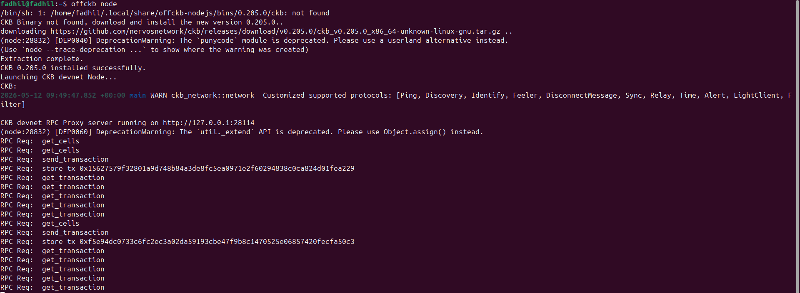
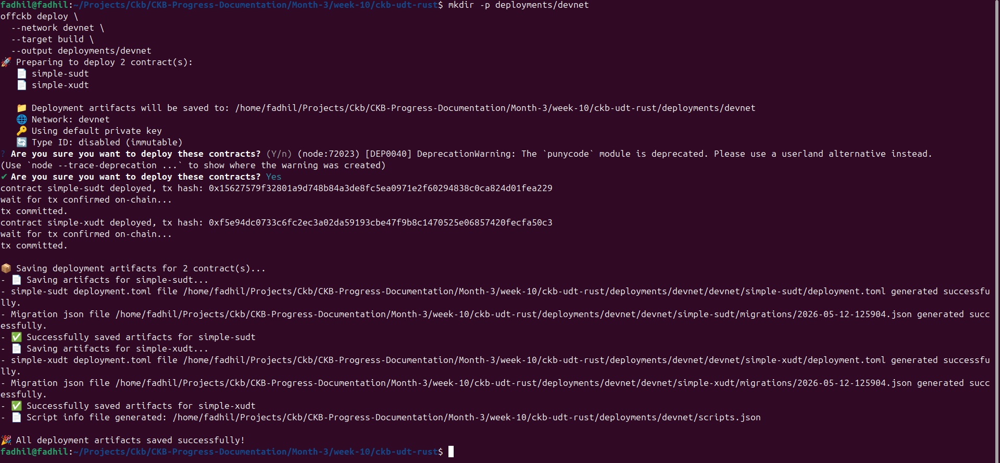

# Week 8 
## CKB sUDT / xUDT Rust Deployment

## Overview

This week focuses on practical CKB smart contract development in Rust for custom token standards. The work includes:

- Building a custom `simple-sudt` contract in Rust
- Extending the token validator to `simple-xudt` with optional extension data
- Deploying both contracts to CKB devnet
- Creating an off-chain mint tool to build and send token issuance transactions

## Week 8 Outcomes

### Contracts and deployment

The project is organized in `ckb-udt-rust/` with a workspace containing:

- `contracts/simple-sudt` — a minimal fungible token validator
- `contracts/simple-xudt` — an extensible token validator with extra payload validation
- `tools/mint-token` — an off-chain transaction builder for minting a token cell

Deployment artifacts were generated to:

- `ckb-udt-rust/deployments/devnet/devnet/simple-sudt`
- `ckb-udt-rust/deployments/devnet/devnet/simple-xudt`
- `ckb-udt-rust/deployments/devnet/scripts.json`

### Confirmed devnet metadata

The deployed devnet script metadata includes:

- `simple-sudt` code hash: `0xaf49063e2836e3d0f8fbb913a0532d47f0e3534e9db6232e7f7b803c0736e228`
- `simple-xudt` code hash: `0x465f7579592a41e824ae5526e2350092eeab3c2175e4eeab1fdc254b45b620b3`

## Key code examples

### `simple-sudt` validation logic

This contract ensures token transfer totals are not increased unless the authorized owner is included in the inputs.

```rust
let input_total = sum_amounts(Source::GroupInput)?;
let output_total = sum_amounts(Source::GroupOutput)?;

if output_total <= input_total {
    return Ok(());
}

if has_owner_input()? {
    return Ok(());
}

Err(Error::UnauthorizedMint)
```

### `simple-xudt` extension validation

The xUDT contract adds an extensibility layer and validates both the extension args and extension data payload size.

```rust
fn validate_extension_args() -> Result<(), Error> {
    let script = load_script().map_err(|_| Error::InvalidData)?;
    let args: Vec<u8> = script.args().unpack();

    if args.len() < 20 {
        return Err(Error::InvalidData);
    }

    let extension_args = &args[20..];
    if extension_args.len() > 1024 {
        return Err(Error::InvalidExtensionData);
    }

    Ok(())
}
```

### Off-chain mint tool

The minting utility builds the owner lock and token type script, then constructs a transaction with a token cell and sends it through local CKB RPC.

```rust
let token_output = CellOutput::new_builder()
    .capacity(TOKEN_CELL_CAPACITY_SHANNONS)
    .lock(owner_lock.clone())
    .type_(Some(token_type).pack())
    .build();

let builder = CapacityTransferBuilder::new(vec![
    (token_output, token_data),
]);
```

## Visual workflow



*Devnet node execution showing RPC requests during contract deployment and transaction submission.*



*Contract and transaction flow diagram for sUDT/xUDT deployment*

## Notes and next steps

- Complete transaction-level validation for both `simple-sudt` and `simple-xudt` on devnet
- Confirm the off-chain mint tool successfully sends and commits token issuance transactions
- Validate that extension payload limits are enforced in practice and that invalid payloads fail as expected

## File references

- `ckb-udt-rust/Cargo.toml`
- `ckb-udt-rust/contracts/simple-sudt/src/main.rs`
- `ckb-udt-rust/contracts/simple-xudt/src/main.rs`
- `ckb-udt-rust/tools/mint-token/src/main.rs`
- `ckb-udt-rust/deployments/devnet/scripts.json`
