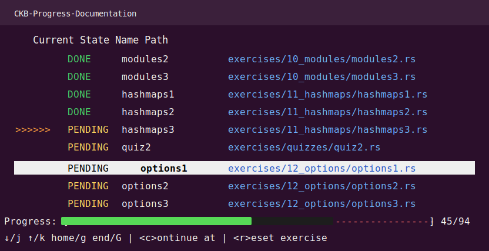

# Week 9: Understanding Spore 

This week was less about rushing into a polished product and more about slowing down enough to properly understand **Spore**, **Digital Objects**, and how ownership-oriented assets on CKB differ from the NFT mental model I was already used to from Ethereum.

Coming from Ethereum, I already had a decent grasp of NFTs at a high level: unique assets, metadata, ownership, transfer rules, and collectible-style primitives. But while that background helped me get oriented quickly, Spore pushed me to think in a more CKB-native way. Instead of treating digital objects as just another familiar NFT pattern, I spent most of this week trying to understand how the Spore model actually works under the hood and how it maps onto the CKB Cell model.

---

## What I Focused On This Week

The biggest part of the week was spent **tinkering**.

I explored Spore from the perspective of someone trying to bridge two mental models:

- The **Ethereum/NFT** understanding I already had.
- The **CKB / Cell-model / Digital Object** way of thinking that Spore introduces.

That meant I was not just reading docs casually. I was actively trying to internalize:

- how a **Digital Object** should be thought about on CKB,
- how Spore expresses asset logic in a more CKB-native way,
- how issuance and ownership constraints can be modeled,
- and what a minimal badge-like system would look like if implemented as a practical experiment.

---

## Main Experiment: A Simple Spore Badge System

To make the learning concrete, I implemented a simple **badge-like system** inside [`sporebadges`](./sporebadges/README.md).

The goal was not to build a complete production-ready protocol, but to use code as a way to understand the mechanics better. I created a small Rust-based contract experiment around the idea of badges and basic validation rules.

Some of the ideas reflected in the prototype include:

- a lightweight **badge structure** with fields like issuer, level, and transferability,
- validation logic around transaction structure,
- an early **issuer / permission-oriented** approach for badge behavior,
- and tests exploring a **soulbound-style** path where a badge should not behave like a freely transferable asset.

This helped me move from "I think I understand Spore conceptually" to "I can reason about how a digital object style system might actually be enforced on CKB."

---

## What Clicked for Me

The most valuable part of this week was realizing that my Ethereum NFT background was useful, but only up to a point.

On Ethereum, it is easy to think in terms of contracts holding canonical state around tokens. On CKB, and especially when thinking through Spore and Digital Objects, the model feels more grounded in **Cells, scripts, and explicit state transitions**. That shift matters. It changes how I think about ownership, issuance, transfer rules, and even what an "object" really is at the protocol level.

So while I started the week from a familiar NFT mindset, I ended it with a much stronger appreciation for how CKB-native digital objects are a different design space, not just a copy of Ethereum collectibles with different tooling.

---

## Also Happening: Rust Fundamentals Refresh

At the same time, I was also juggling this Spore exploration with a return to my **Rust fundamentals**. Since most of the experiments this month are getting closer to low-level CKB scripting, I wanted to keep sharpening the language side too instead of only focusing on blockchain-specific concepts.

The screenshot below captures part of that parallel effort while I was working through Rust exercises again:

That balance mattered this week:

- part of my time went into understanding **CKB and Spore concepts**,
- and part of it went into making sure my **Rust foundation** stays strong enough to implement those ideas confidently.

---

## Outcome

By the end of the week, I had not only spent time understanding **Spore** and **Digital Objects** from a conceptual point of view, but I had also turned that understanding into a small working experiment through the badge prototype.

More importantly, this week helped me connect three things together:

- my previous **Ethereum NFT intuition**,
- my growing understanding of **CKB's Cell-based design**,
- and my ongoing effort to get more comfortable building these ideas directly in **Rust**.

That combination made Week 9 feel less like feature shipping and more like building the mental model I will need for stronger CKB-native products later.
